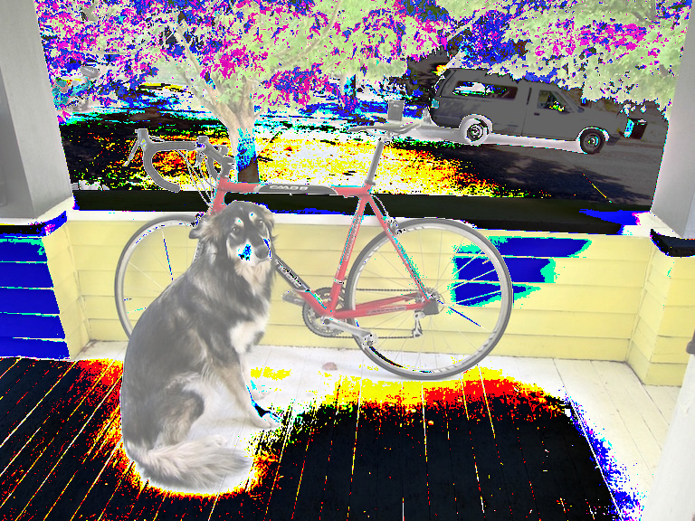
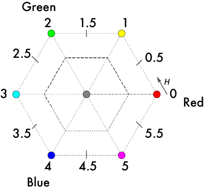
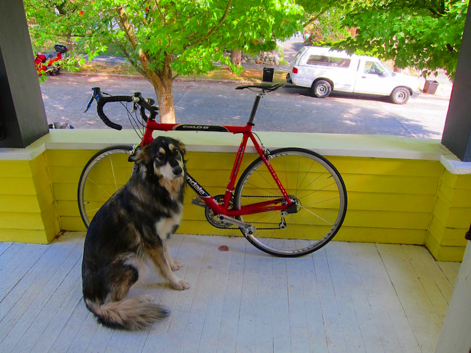

# CSE 576 Homework 1 #

Welcome friends,

For the first assignment we'll just get to know the codebase a little bit and practice manipulating images, transforming things, breaking stuff, it should be fun!


## Setting up codebase ##

### Download the repository ###
Download from github.

    git clone https://github.com/holynski/cse576_sp20_hw1

### Install CMake ###

    https://cmake.org/install/

### Compile ###
We will build the library using `cmake` and `make`. Conveniently there is a bash script `compile.sh`, that does that for you. We advise to use Linux or MacOS for the homework since setting up cmake and make will be simpler.

#### Linux and MacOS ####
Go to the downloaded folder and here are some commands that can help you:

    ./compile.sh # runs cmake and make for you and produces ./test0
    # that is basically all you should need.
    ./clean.sh # cleans all files
    ./compile.sh # compiles again

Or if you want to compile manually do this:

    cd build
    rm -rf *
    cmake ..
    make -j4

#### Windows ####
For windows, first install cmake and look at this [video](https://www.youtube.com/watch?v=gYmgbqGfv-8) to use cmake with Visual Studio. Since there are no external dependencies, if you're familiar with Visual Studio, you can also create a project and import the .H and .CPP files directly. Online resources should be enough to get things going, but if you get stuck the TAs are there to help you.


### Run/Test ###

Everytime you make any changes to the code, run the above build command. We have provided a simple test program to test some of the functionality. Then you can quickly test your changes by running:

    ./test0

If you run the above code without making any changes to the original repo, you will get the following result:

    17 tests, 3 passed, 14 failed

Once everything is implemented correctly, you will get:

    17 tests, 17 passed, 0 failed

Getting all tests passed is not a guarantee that your program is 100% correct. We are going to do a lot more extensive testing.


## Image basics ##

We have a basic C++ structure to store images in our library. The `Image` struct stores the image metadata like width, height, and number of channels. It also contains the image data stored as a floating point array. You can check it out in `src/image.h`, it looks like this:

    struct Image
    {
        int h,w,c;
        float *data;
        .......
    };

If you want to make a new image with dimensions Width x Height x Channels you can define:

    Image im(w,h,c);

The structure has all the necessary operators defined, so you can copy, reassign, pass as a reference to functions, etc.:

    Image im(5,6,7);
    Image im2=im;

    im=im2;

    void scramble_image(const Image& image);

Always pass images as `const Image& image` if you are accessing only or `Image& image` if modifying. See the provided code for guidance.

If you want to access pixels you can do:

    float value = im(0,2,1); // gets the pixel at column 0, row 2 and channel 1
    im(3,0,2) = 0.76;  // sets the pixel at column 3, row 0 and channel 2

If you specify out of bounds coordinates you will get an error.

We have also provided some functions for loading and saving images. The binary format might become useful later in the course. Use any of the functions (both member and standalone):

    Image im = load_image("image.jpg");
    im.load_image("another.png");
    im.load_binary("binary.bin");


to load a new image. To save an image use:

    im.save_image("output");   // save_image saves the image as a .jpg file
    im.save_png("output");     // save_png  saves the image as a .png file
    im.save_binary("output.bin") // save_binary saves as a raw binary file

Feel free to explore `image.h` and the `struct Image {...}` to familiarize with it. Also explore the other provided files if you are interested in the implementation of loading/saving, etc. We use the `stb_image` libary for the actual loading and saving of jpgs because that is, like, REALLY complicated. I think. I've never tried.

You'll be modifying and submitting `ONLY` the files `src/process_image.cpp` and `src/access_image.cpp`.


## 1. Getting and setting pixels ##

The most basic operation we want to do is change the pixels in an image. As we talked about in class, we represent an image as a 3 dimensional tensor. We have spatial information as well as multiple channels which combine together to form a color image:


The convention is that the coordinate system starts at the top left of the image, like so:


In our `data` array we store the image in `CHW` format. The first pixel in data is at channel 0, row 0, column 0 (note that the rows correspond to the Y axes and columns correspond to the X axes). The next pixel is channel 0, row 0, column 1, then channel 0, row 0, column 2, etc. The accessor operator `image(1,2,1)` actually needs the address of the pixel value

Your first task is to fill out the function that computes it in `src/access_image.cpp`:

    int pixel_address(const Image& im, int x, int y, int ch);

`pixel_address` should return the location in the data array of the pixel value at `x,y,ch`.

Note that the `()` operator for `Image` is overloaded for pixel access (see `image.h`). It will use your `pixel_address` function to find the correct pixel location.

Although by default the pixel access operator `image(1,2,1)` does bounds checking in some circumstances it is easier if we adopt a padding strategy and not worry about bounds. There are a number of possible padding strategies:


We will use the `clamp` padding strategy. This means that if the programmer asks for a pixel at column -3, use column 0, or if they ask for column 300 and the image is only 256x256 you will use column 255 (because of zero-based indexing).

Implement the following two functions in `src/access_image.cpp`:

    float get_clamped_pixel(const Image& im, int x, int y, int ch);
    void set_pixel(Image& im, int x, int y, int c, float value);

`set_pixel` should simply return without doing anything if you pass in out-of-bounds coordinates. For `get_clamped_pixel` we will perform padding to the image.

Note that you can use the `()` operator e.g., `im(3, 2, 0)` to access pixels.


We can test out our pixel-setting code on the dog image by removing all of the red channel. If you wish, make a new executable similar to `test0`, where you can explore using your newly written image library. Follow the example from `CMakeLists.txt` and `src/test/test0.cpp` to create new executables.

    // 1-2. Getting and setting pixels
    Image im2 = load_image("data/dog.jpg");
    for (int i=0; i<im2.w; i++)
        for (int j=0; j<im2.h; j++)
            im2(i, j, 0) = 0;
    im2.save_image("output/set_pixel_result");

Then try running it. Check out our very not red dog:


## 2. Copying images ##

Sometimes you have an image and you want to copy it! To do this we should make a new image of the same size and then fill in the data array in the new image. You could do this by assigning pixels from one image to another, by looping over the whole array and just copying the floats (pop quiz: if the image is 256x256x3, how many total pixels are there?), or by using the built-in memory copying function `memcpy`.

Fill in the function `void copy_image(Image& to, const Image& from)` in `src/access_image.cpp` with your code.

## 3. Grayscale image ##

Now let's start messing with some images! People like making images grayscale. It makes them look... old? Or something? Let's do it.

Remember how humans don't see all colors equally? Here's the chart to remind you:


This actually makes a huge difference in practice. Here's a colorbar we may want to convert:


If we convert it using an equally weighted mean K = (R+G+B)/3 we get a conversion that doesn't match our perceptions of the given colors:


Instead we are going to use a weighted sum. Now, there are a few ways to do this. If we wanted the most accurate conversion it would take a fair amount of work. sRGB uses [gamma compression][1] so we would first want to convert the color to linear RGB and then calculate [relative luminance](https://en.wikipedia.org/wiki/Relative_luminance).

But we don't care about being toooo accurate so we'll just do the quick and easy version instead. Video engineers use a calculation called [luma][2] to find an approximation of perceptual intensity when encoding video signal, we'll use that to convert our image to grayscale. It operates directly on the gamma compressed sRGB values that we already have! We simply perform a weighted sum:

    Y' = 0.299 R' + 0.587 G' + .114 B'

Using this conversion technique we get a pretty good grayscale image! Now `test_grayscale()` in `test0.cpp` will output `grayscale_result.jpg`.


Implement this conversion for the function `rgb_to_grayscale` in `process_image.cpp`. Return a new image that is the same size but only one channel containing the calculated luma values.

## 4. Shifting the image colors ##

Now let's write a function to add a constant factor to a channel in an image. We can use this across every channel in the image to make the image brighter or darker. We could also use it to, say, shift an image to be more or less of a given color.

Fill in the code for `void shift_image(image im, int c, float v);` in `process_image.cpp`. It should add `v` to every pixel in channel `c` in the image. Now we can try shifting all the channels in an image by `.4` or 40%. See lines 82-86 in `test.c`:

    // 4. Shift Image
    shift_image(im, 0, .4);
    shift_image(im, 1, .4);
    shift_image(im, 2, .4);
    im.save_image("output/shift_result");

But wait, when we look at the resulting image `shift_result.jpg` we see something bad has happened! The light areas of the image went past 1 and when we saved the image back to disk it overflowed and made weird patterns:



## 5. Clamping the image values

Our image pixel values have to be bounded. Generally images are stored as byte arrays where each red, green, or blue value is an unsigned byte between 0 and 255. 0 represents none of that color light and 255 represents that primary color light turned up as much as possible.

We represent our images using floating point values between 0 and 1. However, we still have to convert between our floating point representation and the byte arrays that are stored on disk. In the example above, our pixel values got above 1 so when we converted them back to byte arrays and saved them to disk they overflowed the byte data type and went back to very small values. That's why the very bright areas of the image looped around and became dark.

We want to make sure the pixel values in the image stay between 0 and 1. Implement clamping on the image so that any value below zero gets set to zero and any value above 1 gets set to one.

Fill in `void clamp_image(image im);` in `process_image.cpp` to modify the image in-place. Then when we clamp the shifted image and save it we see much better results, see lines 87-89 in `test.c`:

    // 5. Clamp Image
    clamp_image(im);
    im.save_image("output/clamp_result");

and the resulting image, `clamp_result.jpg`:


## 6. RGB to Hue, Saturation, Value ##

So far we've been focussing on RGB and grayscale images. But there are other colorspaces out there too we may want to play around with. Like [Hue, Saturation, and Value (HSV)](https://en.wikipedia.org/wiki/HSL_and_HSV). We will be translating the cubical colorspace of sRGB to the cylinder of hue, saturation, and value:


[Hue](https://en.wikipedia.org/wiki/Hue) can be thought of as the base color of a pixel. [Saturation](https://en.wikipedia.org/wiki/Colorfulness#Saturation) is the intensity of the color compared to white (the least saturated color). The [Value](https://en.wikipedia.org/wiki/Lightness) is the perception of brightness of a pixel compared to black. You can try out this [demo](http://math.hws.edu/graphicsbook/demos/c2/rgb-hsv.html) to get a better feel for the differences between these two colorspaces. For a geometric interpretation of what this transformation:


Now, to be sure, there are [lots of issues](http://poynton.ca/notes/colour_and_gamma/ColorFAQ.html#RTFToC36) with this colorspace. But it's still fun to play around with and relatively easy to implement. The easiest component to calculate is the Value, it's just the largest of the 3 RGB components:

    V = max(R,G,B)

Next we can calculate Saturation. This is a measure of how much color is in the pixel compared to neutral white/gray. Neutral colors have the same amount of each three color components, so to calculate saturation we see how far the color is from being even across each component. First we find the minimum value

    m = min(R,G,B)

Then we see how far apart the min and max are:

    C = V - m

and the Saturation will be the ratio between the difference and how large the max is:

    S = C / V

Except if R, G, and B are all 0. Because then V would be 0 and we don't want to divide by that, so just set the saturation 0 if that's the case.

Finally, to calculate Hue we want to calculate how far around the color hexagon our target color is.



We start counting at Red. Each step to a point on the hexagon counts as 1 unit distance. The distance between points is given by the relative ratios of the secondary colors. We can use the following formula from [Wikipedia](https://en.wikipedia.org/wiki/HSL_and_HSV#Hue_and_chroma):


There is no "correct" Hue if C = 0 because all of the channels are equal so the color is a shade of gray, right in the center of the cylinder. However, for now let's just set H = 0 if C = 0 because then your implementation will match mine.

Notice that we are going to have H = \[0,1) and it should circle around if it gets too large or goes negative. Thus we check to see if it is negative and add one if it is. This is slightly different than other methods where H is between 0 and 6 or 0 and 360. We will store the H, S, and V components in the same image, so simply replace the R channel with H, the G channel with S, etc. Watch out for divide-by-zero when computing the saturation!

Fill in `void rgb_to_hsv(Image& im)` in `process_image.cpp` to convert an RGB image into an HSV image in-place. Since this transformation is done per-pixel you can just iterate over each pixel and convert them.

## 7. HSV to RGB ##

Okay, now let's do the reverse transformation. You can use the following equations:

```

// Given the H, S, V channels of an image:
C = V * S
X = C * (1 - abs((6*H mod 2) - 1)  // You can use the fmod() function to do a floating point modulo.
m = V - C
```


```
(R, G, B) = (R'+m, G'+m, B'+m)
```

Fill in `void hsv_to_rgb(Image& im)` in `process_image.cpp` with this in-place transformation.

Finally, when your done we can mess with some images! In `test.c` we convert an image to HSV, increase the saturation, then convert it back, lines 108-114:

    // 6-7. Colorspace and saturation
    Image im2 = load_image("data/dog.jpg");
    rgb_to_hsv(im2);
    shift_image(im2, 1, .2);
    clamp_image(im2);
    hsv_to_rgb(im2);
    im2.save_image("output/colorspace_result");


Hey that's exciting! Play around with it a little bit, see what you can make. Note that with the above method we do get some artifacts because we are trying to increase the saturation in areas that have very little color. Instead of shifting the saturation, you could scale the saturation by some value to get smoother results!

## 8. A small amount of extra credit ##

Implement `void scale_image(image im, int c, float v);` to scale a channel by a certain amount. This will give us better saturation results. Note, you will have to add the necessary lines to the header file(s), it should be very similar to what's already there for `shift_image`. Now if we scale saturation by `2` instead of just shifting it all up we get much better results:

    Image im = load_image("data/dog.jpg");
    rgb_to_hsv(im);
    scale_image(im, 1, 2);
    clamp_image(im);
    hsv_to_rgb(im);
    im.save_image("output/dog_scale_saturated");



## 9. Super duper extra credit ##

Implement RGB to [Hue, Chroma, Lightness](https://en.wikipedia.org/wiki/CIELUV#Cylindrical_representation_.28CIELCH.29), a perceptually more accurate version of Hue, Saturation, Value. Note, this will involve gamma decompression, converting to CIEXYZ, converting to CIELUV, converting to HCL, and the reverse transformations. The upside is a similar colorspace to HSV but with better perceptual properties!

## Turn it in ##

You only need to turn in ONLY the 2 files: `access_image.cpp` and `process_image.cpp`. Do not change any of the other files and do not change the signature lines of the functions. We will rely on those to be consistent for testing. You are free to define any amount of extra structs/classes, functions, global variables that you wish. Use the canvas link on the class website. Do not submit anything extra.

[1]: https://en.wikipedia.org/wiki/SRGB#The_sRGB_transfer_function_("gamma")
[2]: https://en.wikipedia.org/wiki/Luma_(video)

#### Grading ####
    pixel_address        2
    get_clamped_pixel    1
    set_pixel            3
    copy_image           2
    rgb_to_grayscale     2
    shift_image          3
    clamp_image          2
    rgb_to_hsv           5
    hsv_to_rgb           5
                        25
    
    EXTRA CREDIT:
    
    scale_image                   1   OPTIONAL                         
    rgb_to_luv                    2   OPTIONAL 
    luv_to_rgb                    2   OPTIONAL  
